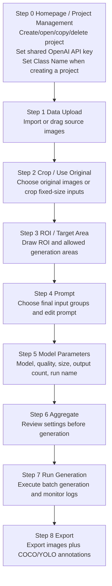

# GPT GenImage UI

`GPT GenImage UI` is a PySide6 desktop workflow for preparing defect-image inputs,
calling the OpenAI GPT Image API, and exporting generated results as image datasets.
The app is organized as a guided step-by-step UI and keeps project-specific inputs,
configuration, runs, exports, and logs under `project/<project_name>/`.

The current visible workflow has 9 steps: `Step 0` plus `Step 1` through `Step 8`.
Class Name is configured when a project is created in Step 0, and the OpenAI API key
is shared by all projects from Step 0.

---

## 1. Install

### Windows

```bat
python -m venv .venv
.\.venv\Scripts\activate
python -m pip install --upgrade pip
python -m pip install -r requirements.txt
```

### Linux / macOS

```bash
python -m venv .venv
source .venv/bin/activate
python -m pip install --upgrade pip
python -m pip install -r requirements.txt
```

Required packages are listed in `requirements.txt` and include:

- `PySide6` for the desktop UI
- `openai` and `python-dotenv` for GPT Image API calls
- `pillow`, `numpy`, and `opencv-python` for image and mask processing

---

## 2. Launch

```bash
python launch_ui.py
```

Convenience launchers are also available:

```bat
quick_start_ui_windows.bat
```

```bash
bash quick_start_ui_linux.sh
```

If the launcher reports that `PySide6` or Qt cannot be imported, activate the same
virtual environment where `requirements.txt` was installed and run `python launch_ui.py`
again.

---

## 3. Current Workflow



The UI keeps older internal step indexes for compatibility with existing project
state files, but the visible sidebar and page titles now use the 9-step flow above.

---

## 4. Step Details

### Step 0: Homepage / Project Management

- Create a new project with both `Project Name` and `Class Name`.
- Save or replace the shared `OPENAI_API_KEY` used by all projects.
- Open, copy, or delete existing project cards.
- Project names must be unique.
- Reopening a project returns to Step 0 while preserving completed-step state and
  existing artifacts.

### Step 1: Data Upload

- Import source images through the file picker or drag-and-drop.
- Uploaded originals are stored under:

```text
project/<project_name>/data/00_raw_images/<class_name>/
```

### Step 2: Crop / Use Original

- Either use original images directly or crop fixed-size inputs.
- Crop width and height are UI input dimensions for preparing Step 3 inputs.
- Existing generation runs and exports are preserved when adding more Step 3 inputs.
- Prepared inputs are stored under:

```text
project/<project_name>/data/01_inputs/<class_name>/images/
```

### Step 3: ROI / Target Area

- Draw one or more ROI rectangles for original defect locations.
- Draw Target Area regions where new defects may be generated.
- Target Area supports rectangle and polygon drawing.
- In selection mode, ROI and rectangular Target Area boxes can be resized with corner
  and edge handles.
- Step 3 auto-saves region files and masks after edits.
- ROI masks and Target Area masks are stored under:

```text
project/<project_name>/data/01_inputs/<class_name>/masks/
project/<project_name>/data/01_inputs/<class_name>/target_area_masks/
project/<project_name>/data/01_inputs/<class_name>/regions/
```

Useful shortcuts in this step include:

- `R`: draw ROI
- `S`: select ROI
- `T`: draw rectangular Target Area
- `L`: draw polygon Target Area
- `Y`: select Target Area
- `A` / `D`: delete all / selected ROI
- `G` / `H`: delete all / selected Target Area
- `Up` / `Down`: switch image

### Step 4: Prompt

- Choose the final image groups used for generation.
- Use Ctrl/Shift multi-select; the UI limits a batch to at most 16 groups.
- Edit a custom prompt or apply a template.
- The final prompt is combined with selected ROI and Target Area information.
- Prompt configuration is stored under:

```text
project/<project_name>/configs/classes/<class_name>/prompt.txt
```

### Step 5: Model Parameters

Available models:

- `gpt-image-2`
- `gpt-image-1.5`
- `gpt-image-1`
- `gpt-image-1-mini`

The UI validates output size rules before generation. For `gpt-image-2`, output
dimensions must satisfy the current app checks, including 16-pixel multiples, valid
aspect ratio, and supported total pixel range.

### Step 6: Aggregate

- Review the selected project, class, image groups, ROI/Target Area coverage, prompt,
  model, quality, size, output count, and run name.
- The aggregate log is written under the current project logs folder.

### Step 7: Run Generation

- Executes `scripts/run_gpt_image2.py` as a subprocess.
- Uses the shared Step 0 API key.
- Uses ROI masks and Target Area masks to repair original defect locations and place
  new defects within allowed areas.
- Shows live logs and generation progress.
- Generation outputs are written under:

```text
project/<project_name>/runs/<class_name>/<run_name>/
```

Each run keeps final generated images plus metadata such as prompts, placement records,
bounding boxes, and logs. Temporary masks and previews are cleaned unless intermediate
files are explicitly kept.

### Step 8: Export

- Exports the current run or all runs for the class.
- Writes normalized output folders under:

```text
project/<project_name>/exports/<class_name>/<run_name>/
```

- Can copy generated images and create COCO / YOLO annotation files.
- Can optionally package artifacts into a zip file in a user-selected local folder.
- Export bounding boxes are scaled back to the final exported image coordinate system.

---

## 5. Project Files and Generated Artifacts

Runtime artifacts are intentionally ignored by Git:

- `project/`
- `logs/`
- `configs/`
- `runs/`
- `exports/`
- zip/tar archives
- `.env` and key files

This keeps uploaded images, generated outputs, masks, logs, API keys, and temporary
exports out of source control.

The main source files are:

```text
launch_ui.py                  # UI launcher
ui_gpt_defect/app.py          # Main PySide6 app
scripts/run_gpt_image2.py     # GPT Image generation backend
scripts/export_dataset.py     # Dataset export backend
scripts/verify_env.py         # Environment verification helper
tools/                        # Image/mask editor utilities
```

---

## 6. Environment and Secrets

The UI stores the shared API key in `.env` as `OPENAI_API_KEY=...`.
The key preview shown in the UI is masked and should not be committed.

To verify Python syntax after code changes:

```bash
python -m compileall .
```

To inspect the current Git state before committing:

```bash
git status
git diff --stat
```
