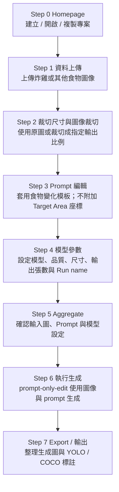

# GPT GenImage UI - Food Prompt Workflow

此版本將原本「工業瑕疵 ROI + Target Area」流程轉型為「食物 / 物件 prompt-only 編輯」流程。裁切或使用原圖後會直接進入 Prompt 編輯；後端生成 workflow 使用 `prompt-only-edit`，不再要求 bbox、segment 或 Target Area mask。

