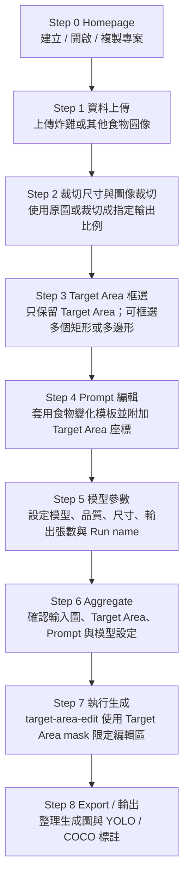

# GPT GenImage UI - Food Target Area Workflow

此版本將原本「工業瑕疵 ROI + Target Area」流程轉型為「食物 / 物件 Target Area 限定變化」流程。Step 3 僅保留 Target Area 框選，Step 4 改為食物變化 prompt；後端生成 workflow 使用 `target-area-edit`，把 Target Area mask 作為唯一允許編輯的範圍。

